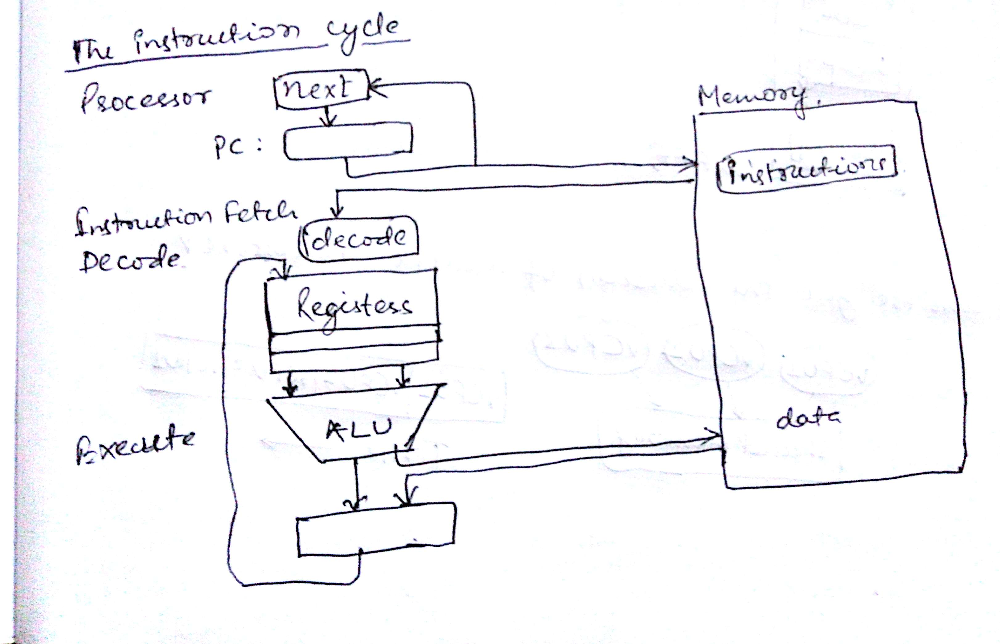
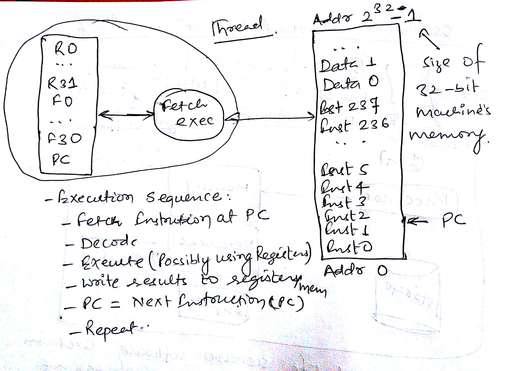
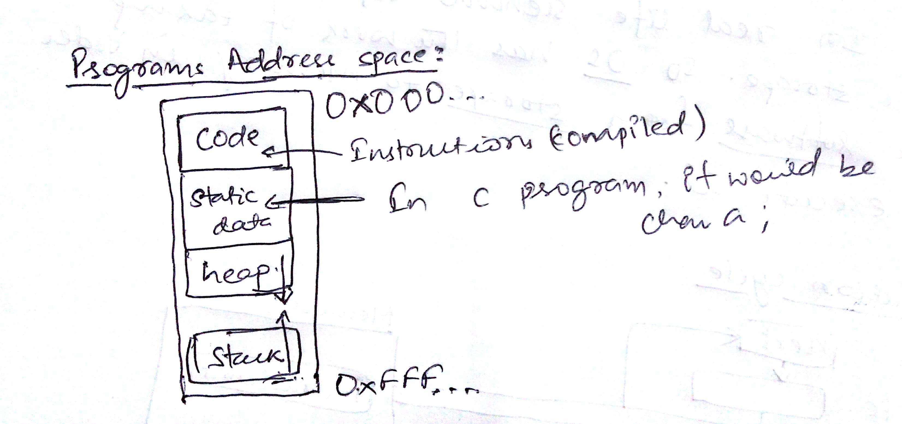
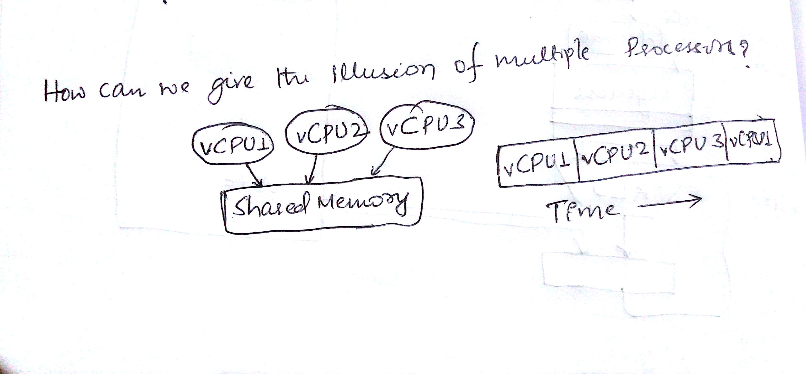
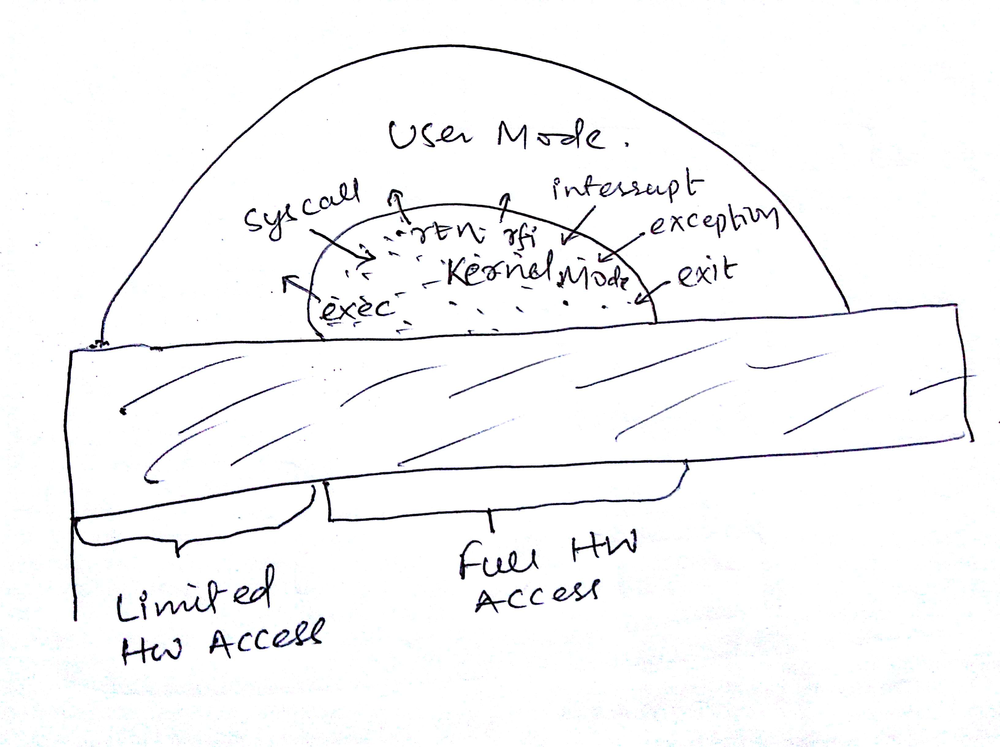
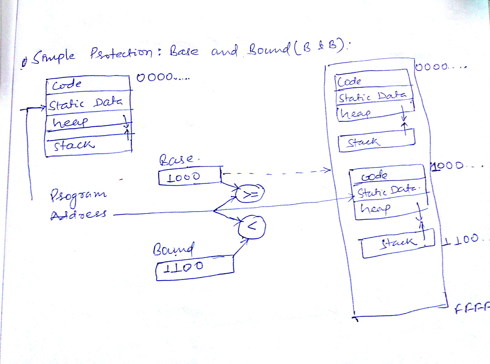
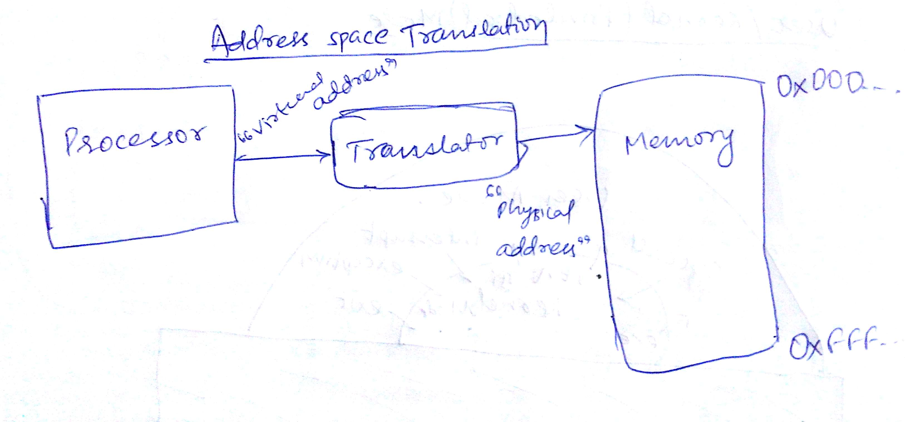
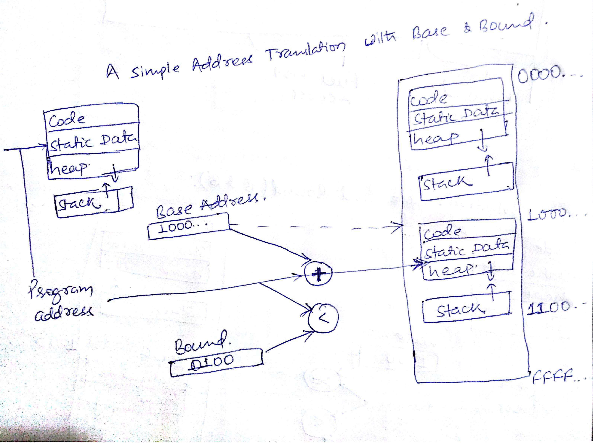
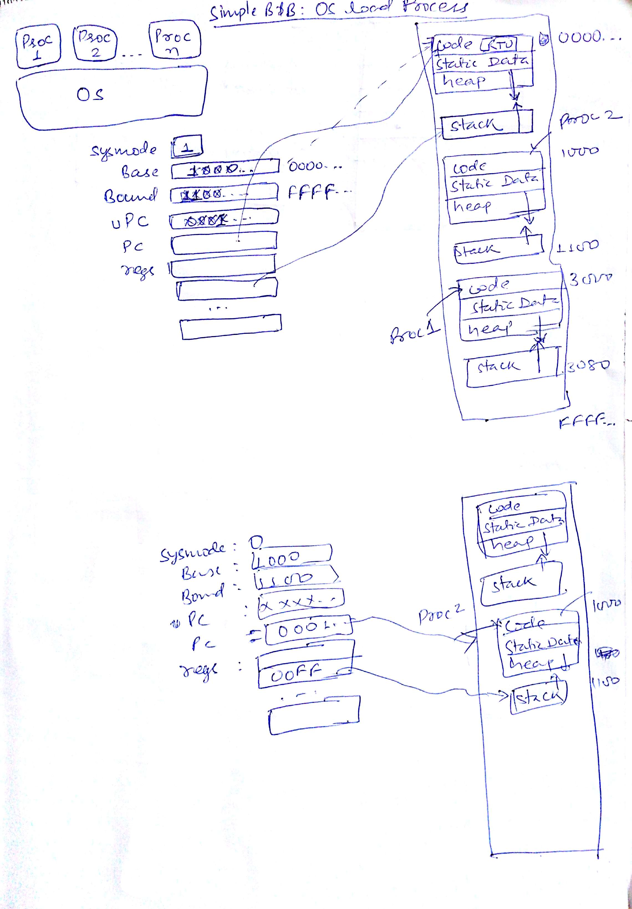
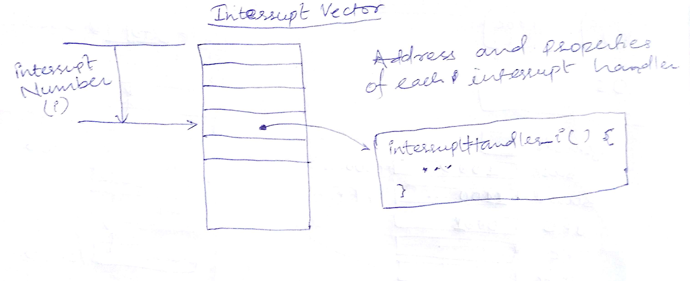

What is an operating system?
> Special layer of software that provides application
software access to hardware resources
> 1. Convenient abstraction of complex hardware devices
> 2. Protected access to shared resources
> 3. Security and authentication
> 4. Communication amongst logical entities

Another definition:
>1. Referee
>     - Manage sharing of resources, Protection, Isolation
>       - Resource allocation, isolation, communication
>2. Illusionist
>     - Provide clean, easy to use abstractions of physical resources
>       - Infinite memory, dedicated machine
>       - Higher level objects: files, users, messages
>       - Masking limitations, virtualization
>3. Glue
>     - Common services
>       - Storage, Window system, Networking
>       - Sharing, Authorization
>       - Look and feel

What exactly is an OS?
- "The one program running at all times on the
computer" is the `kernel`.
  - Everything else is either a `system program` (ships with the OS) or
  an application program.

**Note**: `OS Hardware virtualization` layer allows
developers to write a software only once
without worrying about the hardware it
requires to interact with.

Difference between `program` and `process`?
> A program is a thing which we write.

> A process is the instance of the program thats running

Meaning of I/O?
> Providing a virtual abstraction of devises
to the processes that are running.

> ex: Storage Abstraction: File System
> Networking Abstraction: Sockets

**Note**
>50% of OS crash is because of `devise drivers`
Because most of the devise drivers are 3rd party.
So the writer of the devise drivers are somebody who 
has not written the OS.

Moore's Law:
> 2x transistors/chip every 1.5 years called
`Moore's Law`.

Types of `virtual machine`:
1. Process VM: Supports the execution of a 
single program; this functionality typically provided by OS
2. System VM: Supports the execution of an entire OS
and its applications (e.g. VMWare Fusion, Virtual box,
Parallels Desktop, Xen)

**Process VMs**:
1. Programming simplicity
    - Each process thinks it has all the memory/CPU time
    - Each process thinks it owns all devices
    - Different devices appear to have same high level interface
    - Device interfaces more powerful than raw hardware
      - Bitmapped display => windowing system
      - Ethernet card => reliable, ordered, networking (TCP/IP)
2. Fault Isolation
    - Processes unable to directly impact other processes
    - Bugs cannot crash whole machine
3. Protection and Portability
   - Java interface safe and stable across many platforms
  
**System Virtual Machines**:
- Useful for OS development
  - When OS crashes, restricted to one VM
  - Can aid testing programs on other OSs.
  
  
What is the meaning of `core dump` and `core`?
> Take all the memory state of the thing that is 
running and we store that in a disk somewhere 
so that we can look at it and `debug`.

> Core: It is a type of a memory which was
being used in older computer. So 
`core dump` was taking whatever is there in the 
memory and putting it into a disk.

**Memory**:
- heap: Dynamic memory allocation using `malloc`.
- stack: Store variables and recursive procedures.

 
**Thread of Control**:
- Thread: Single unique execution context
  - Program counter, Registers, Execution Flags, Stack plus all the
  state in the memory that matters.

**Note**: Here `single unique execution context` means
that whenever we run some program it gets executed in
form of `instruction set` and at any given point of time
the `instruction` which is getting executed will have
some values in registers, it will also have a `program counter`.
So the context will always be unique because of the unique 
values in `PC`, `Registers` etc.
Have a look at the below attached image for more clarity

> When we think of virtualizing the execution
sequence, we have to make sure all of the state
that is representative of a given thread have to 
be kept track of in order to make sure we don't 
screw up the execution.

- A thread is executing on a processor when
it is resident in the processor registers.

- `PC` register holds the `address` of the `executing
instruction` in the `thread`.
- Certain registers hold the `context` of 
the `thread`
  - `Stack pointer` holds the address of the top
  of the stack
    - Other conventions: Frame Pointer, Heap Pointer, Data
  - May be defined by the instruction set architecture or
  by compiler conventions.
- Registers hold the root state of the `thread`.
  - The rest is `in memory`.

**Program's Address Space**
- Address space => the set of accessible addresses + state associated with them:
  - For a 32-bit processor there are 232 = 4 billion addresses
  
**Note**:
1 bit is `1` or `0`. 1 bit is a `single state`, you put 
8 of them and it will be `Byte`. So in a 32-bit processor
we can have either `0` or `1` for every bit. So
we will have 232 addresses.

- What happens when you read or write to an address?
  - Perhaps Nothing
  - Perhaps acts like regular memory
  - Perhaps ignores writes
  - Perhaps causes I/O operation
    - (Memory-mapped I/O)
  - Perhaps causes exception (fault)
  
> The address space of the given system or process
is basically the whole set of addresses and the data
in there and the behavior that you will get when you 
read and write from it.

**Multiprogramming - Multiple Threads of Control**:
- If we have processors as many as threads then there is
no problem, because each processor will execute one
thread.
- But suppose we have only one `processor`, then we have to
fake that we have multiple `processor`, although in reality 
we have only one.

How can we give the illusion of multiple processors?
- Assume a single processor. How do we provide the illusion of 
multiple processors?
  - `Multiplex in time`!
  - We will provide the illusion that we have several threads
  sharing some memory and they are all executing as if each one of 
  them has their own `CPU`.
  Have look at the images below.
    - In the below image for time multiplexing of vCPUs, we are missing one thing,
    `OS is also having share of the CPU`
    - In later sections we have seen that threads shown in the below picture are
    part of a `process` because a `process` has its own `address space` but there
    exist another process just like the one in the image but these two are not
    able to interfere with each other.
  
  
  
  
  - If we do the multiplexing well we could have the illusion
  that those are being executed on different processors without 
  necessarily to have more than one processor.
  
- Each virtual `CPU` needs a structure to hold:
  - Program Counter (PC), Stack Pointer(SP)
  - Registers (Integer, Floating point, others..)
  
- How switch from one virtual CPU to the next?
  - Save PC, SP, and registers in current state block
  - Load PC, SP, and registers from the next state block
  
- What triggers switch?
  - Timer, voluntary yield, I/O, other things
  > Voluntary yield means telling the OS that the CPU is no longer
  needed and can be taken off.
  ex: Sleep is a voluntary yield 
  
**The Basic Problem of Concurrency**
- The basic problem of concurrency involves resources:
  - Hardware: single CPU, single DRAM, single I/O devices
  - Multiprogramming API: processes think they have 
  exclusive access to shared resources.

- OS has to coordinate all activity
  - Multiple processes, I/O interrupts, ...
  - How can it keep all these things straight?
  
- Basic Idea: Use `Virtual Machine` abstraction
  - Simple machine abstraction for processes
  - Multiplex these abstract machines.
  
- Dijkstra did this for the `The system`
  - Few thousand lines vs 1 million lines in OS 360 (1k bugs)
  
**Properties of this simple multiprogramming technique**
- All virtual CPUs share same non-CPU resources
  - I/O devices the same
  - Memory the same
  
- Consequence of sharing:
  - Each thread can access the data of every other
  tread(good for sharing, bad for protection)
  - Threads can share instructions
  (good for sharing, bad for protection)
  - Can threads overwrite OS functions? (**YES**)
  
- This(unprotected) model is common in:
  - Embedded applications
  - Windows 3.1/Early Macintosh (switch only with yield)
  - Windows 95-ME(switch with both yield and timer)
  
> What we can do so that we can make it work with protection too.
>
>Ans: We have to make some adjustments so that a program 
can't overwrite the other programs of the operating system.
>
> To achieve that, we need to have some support from hardware.

**Process**
- Process: execution environment with `Restricted Rights`
  - Address Space with One or More Threads
  - Owns memory (address space)
  - Own file descriptors, file system context, ...
  - Encapsulate one or more threads sharing process
  resources 

- Why processes?
  - Protected from each other!
  - OS Protected from them
  - Navigate fundamental trade-off between
  protection and efficiency
  - Processes provides memory protection
  - Threads more efficient than processes
  
 - Application instance consists of one or more processes
 

**Protection**
- OS must protect itself from user programs
  - Reliability: compromising the OS generally causes
  it to crash, and because of a bug in user program the whole OS should
  not crash.
  - Security: limit the scope of what processes can do. If a processes can kill
  other processes, then a `mallicious process` will not allow you to shutdown your
  computer as `shutdown` is also a process.
  - Privacy: limit each process to the data it is permitted to access. If one process
  access private data from another process, then all the private user info will be compromised
  by a `mallicious process`
  - Fairness: each should be limited to its appropriate share.
   
- It must protect User Programs from one another

- Primary Mechanism: limit the translation from program
`address space` to `physical space`
  - can only touch what is mapped in
  
- Additional Mechanisms:
  - Privileged instructions, in/out instructions,
  special registers
  - `syscall processing`, subsystem implementation
    - (e.g., `file access rights`, etc)
    

**Dual Mode Operation**
- `Hardware` provides at least two modes:
  - `Kernel` mode (or `superuser` or `protected`)
  - `User` mode: Normal programs executed
  
- What is needed in the hardware to support `dual mode`
operations?
  - a bit of state(user/system mode bit)
  - Certain operations / actions only permitted in 
  system/kernel mode
    - In user model they `fail` or `trap`
  - User -> Kernel transition `sets` system mode AND saves
    the user `PC`
      - OS code carefully puts aside user state
      then performs the necessary operations.
  - Kernel -> User transition clears system mode AND
  restores appropriate user `PC`
    - return-from-interrupt

  
**Dual mode operations**:
- For executing a `user program` `kernel` 
uses `exec` and then the `user program` calls
`exit` to return control back to the kernel

- When user might try to do something ( like opening a file or a socket)
for that they make a `system call` which is a controlled gate into the 
`kernel` and return from `kernel` goes to user level.

- Some times some hardware issue `interrupts` which `user mode` 
does not have any about. Then the control goes to the `kernel` and
when the interrupt gets serviced, a `return from interrupt` takes
the control back to the `user mode`.

- When we try to `divide by zero`, an exception gets raised
 from `user level` program and the control goes to `kernel` for
 servicing.
 
Now we have an idea about `dual mode` lets have a another look about
the protection question.

- We have very very controlled access in kernel mode
and kernel mode is the special setting in the bit that
says `I can do anything`, while in the `user mode`, 
I am restricted about what I can do.

- With that distinction between full access and limited access
what type of restrictions help me out in making
processes stable.

**Simple Protection: Base and Bound(B&B)**:
- There is a `base register` and a `bound register`.
- The `base register` says 'this current thing that is running' is not
allowed to have any access to `memory` below the `base`.
- The `bound register` says 'this thing running' is not 
allowed to have any access to `memory` above the `bound`.

- So we have a big chunk of memory but by putting 
a `base` and `bound` on it, we can restrict what the
`CPU` is allowed to access from `memory`. And now what we
have to do is we have to move those `base` and `bound` 
around as we are multiplexing to give us the illusion that
we are `multithreading` and to protect different threads from
each other or different processes from each other.

- When running in the `kernel mode` the `kernel` can
change the base and bound registers, but when running in `user mode`
the user `can't` change the `base and bound registers`.

__NOTE__: For more info see the picture attached below.

- Downside:
  - We don't have the illusion about limited space
  - We don't have the illusion that we have `zero`.
  - If we run 2 of the same program, same time, each of them
  has to be relocated differently in order to work.
  - Requires relocating loader.
  
- Still protects OS and isolate pgm.
- No addition on address path.

How do we get `zero` out of this? How do we virtualise it?
- We can use a translator which will add base to 
 the program address which will give us the actual physical
 memory.
 

- In this case we can have `zero` because `zero` is nothing
but (0 + base) which in below case is `1000`.

**Simple B&B: OS load process**:
- Suppose OS is going to load a process, so in the 1st image
we are busy running the OS, notice the `system mode` is `kernel mode`
that's why it's 1. 
- The program counter is busy in OS land, running some 
stuff. 
- This will load `proc 2` in the `memory` and it is loading it
and setting up special register which will be `user pc` and 
it will set the `stack pointer` to to point to the end of 
the `stack space`.
- We are still running in the `kernel` mode
but we will run a special instruction called
`return to user(RTU)`.
- `RTU` will atomically switch the `system mode` from
`1` to `0`. It will load the `uPC` in `PC`.

- So we start running in protected space in `user mode`.
- The user code will not be able to do anything other than 
executing the block of code as `user mode` can not change
`system mode`. So the user code will be stuck until some
`interrupt` happen.

How to return to system?
- 3 types of Mode Transfer:
- `Syscall`
  - Process requests a system service eg. exit
  - Like a function call, but "outside" the process
  - Does not have the address of the system function to call
  - Like a Remote Procedure call(RPC) - for later
  - Marshall the `syscall `id and args in registers and exec `syscall`.
  
- Interrupt
  - External asynchronous event triggers `context switch`
  - eg. Timer, I/O devise
  - Independent of user process.

- Trap or Exception:
  - Internal synchronous event in process triggers context switch
  - eg., Protection violation (segmentation fault), Divide by zero.
  
- All 3 are an `Unprogrammed control transfer`.
  - Where does it go?
  
  - For `interrupts`, a portion of the memory that is
  in the OS called the `interrupt vector`.
  - `Interrupt vector` takes the type of interrupt like `timer interrupt`,
  and that `timer interrupt` in hardware cause the processor to look up 
  an address of `interrupt handler` in the `OS` and start
  executing there.
  All other rectangles in the below image might 
  has address to code in OS for interrupt handlers for `divide by zero` etc.
  
  
  - When `interrupt` happens we transfer in the system mode
  and save where we were and then go jump to this handler.
  
- So in case of simple `B&B` when our processor is executing 
a particular process and time for that processes has run out
, timer interrupt comes(as it is time multiplexing)
and the execution control goes back to the `kernel`.

- When time interrupt happens we save the `PC` to `uPC`, system mode
 gets `sets` and set the `PC` to point to the kernel.
 The `PC` gets sets according to the type of interrupt,
 which tells it to where to go into the OS.
 
- We should notice that we are saving a selective set of things
while moving to the `kernel`, eg: PC, and some other things.

- But we have not save all the stuff, so its up to the OS
to save `the registers` and all the other states of that process in
 order to make sure that OS can return to it later.
 
- So for running a timer interrupt, the timer interrupt code might 
actually save the whole set of registers into the litter chunk of
OS memory and says `whenever I want to code to processes-2 here 
are all the stuff that I need` and similarly load up
the other process.

>So in this way we have protected all the processes from each other
and OS from different processes.

What is wrong with this simplistic address translation mechanism?
> In base and bound approach, we are allocating too much space,
 we are doing so inefficiently.
>
> We want the heap and stack to be able to grow and
and that `hole in the middle` between stack and 
heap too. We have to allocate more space than we can 
possibly need so that we don't have the the two sides 
of `stack and heap running to each other`.
>
> So the problem with base and bound is, it does
not give you a good way to deal with the `hole`.
>
> One more thing which is wrong with base and bound
is, if we have to share some processes we have to make
them overlap.

> In x86, we have segments and each segment
has its own base and bound. So there is a code segment,
stack segment, heap segment. So it solves the problem
of base and bound.